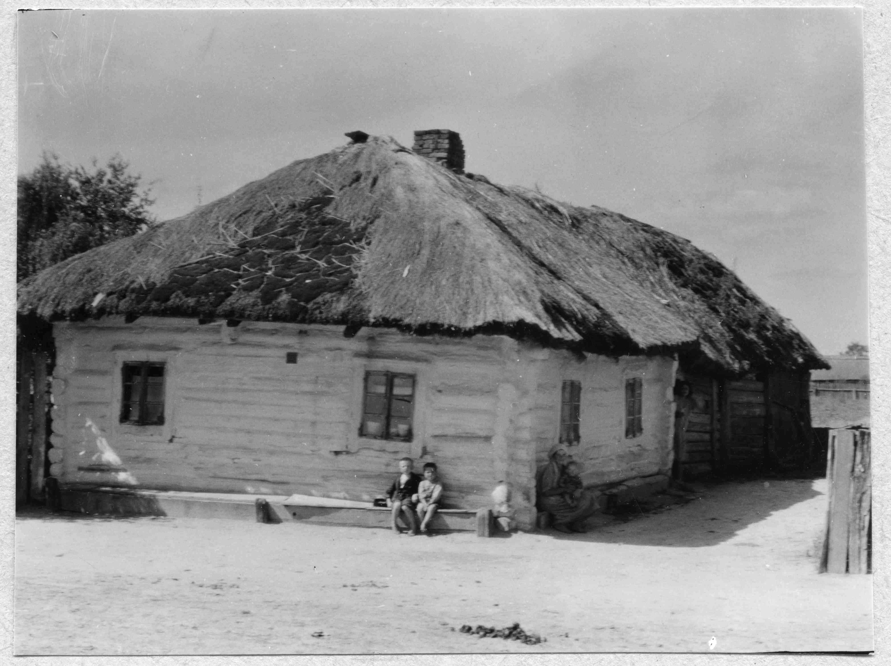

# 📖 Швидкий довідник редагування

## Основи HTML

### Заголовки
```html
<h1>Найголовніший заголовок</h1>
<h2>Заголовок другого рівня</h2>
<h3>Заголовок третього рівня</h3>
```

### Параграфи та текст
```html
<p>Звичайний параграф тексту.</p>
<p><strong>Жирний текст</strong></p>
<p><em>Курсив</em></p>
```

### Посилання
```html
<!-- Посилання на іншу сторінку сайту -->
<a href="history.html">Історія</a>

<!-- Посилання на зовнішній сайт -->
<a href="https://example.com" target="_blank">Зовнішнє посилання</a>

<!-- Email -->
<a href="mailto:info@example.com">Написати email</a>

<!-- Телефон -->
<a href="tel:+380123456789">Зателефонувати</a>
```

### Зображення
```html
<!-- Базове зображення -->


<!-- З класом для стилізації -->

```

### Списки
```html
<!-- Маркований список -->
<ul>
  <li>Пункт 1</li>
  <li>Пункт 2</li>
  <li>Пункт 3</li>
</ul>

<!-- Нумерований список -->
<ol>
  <li>Перший пункт</li>
  <li>Другий пункт</li>
  <li>Третій пункт</li>
</ol>
```

---

## Основи CSS

### Як змінити кольори

У файлі `css/style.css` знайдіть `:root`:

```css
:root {
  --primary-dark: #1a1a1a;     /* Темний колір */
  --accent-gold: #c9a961;      /* Золотий */
  --accent-red: #8b1e1e;       /* Червоний */
  --text-dark: #2c2c2c;        /* Темний текст */
}
```

### Популярні кольори (шістнадцяткові коди):

```
Білий:        #ffffff
Чорний:       #000000
Сірий:        #808080
Червоний:     #ff0000
Синій:        #0000ff
Золотий:      #ffd700
Зелений:      #00ff00
Помаранчевий: #ffa500
```

### Як змінити розмір тексту

```css
/* Знайдіть потрібний елемент у style.css */
h1 {
  font-size: 3rem;  /* Збільшити/зменшити число */
}

p {
  font-size: 1.125rem;
}
```

### Як змінити відступи

```css
.section {
  padding: 6rem 0;  /* Відступи зверху та знизу */
  margin: 2rem 0;   /* Зовнішні відступи */
}
```

---

## Типові завдання

### 1. Додати нову сторінку

**Крок 1:** Скопіюйте `history.html` та перейменуйте на `nova-storinka.html`

**Крок 2:** У ВСІХ HTML файлах додайте в навігацію:
```html
<nav class="main-nav">
  <a href="index.html" class="nav-link">Головна</a>
  <a href="history.html" class="nav-link">Історія</a>
  <a href="nova-storinka.html" class="nav-link">Нова сторінка</a>
  <!-- інші посилання -->
</nav>
```

**Крок 3:** Відредагуйте контент у `nova-storinka.html`

### 2. Змінити фонове фото на головній

```html
<!-- Знайдіть цей рядок у index.html -->


<!-- Змініть на -->

```

### 3. Додати картку на головній сторінці

Скопіюйте і вставте цей блок у секцію `<div class="cards-grid">`:

```html
<article class="card">
  
  <div class="card-content">
    <span class="card-label">Категорія</span>
    <h3 class="card-title">Заголовок картки</h3>
    <p class="card-description">
      Опис картки
    </p>
    <a href="посилання.html" class="card-link">
      Текст посилання
      <span>→</span>
    </a>
  </div>
</article>
```

### 4. Змінити текст у Hero секції

```html
<!-- Знайдіть у index.html -->
<div class="hero-content">
  <span class="hero-label">Історичний портал</span>
  <h1 class="hero-title">Дубровиця</h1>  <!-- ТУТ ЗМІНЮЙТЕ -->
  <p class="hero-description">
    Ваш опис...  <!-- І ТУТ -->
  </p>
</div>
```

### 5. Додати фотографію в галерею

У файлі `photo-archive.html`:

```html
<div class="photo-item" data-category="1900-1945">
  
  <div class="photo-caption">
    Текст підпису до фото
  </div>
</div>
```

**Категорії:**
- `before-1900` — до 1900
- `1900-1945` — 1900-1945
- `1945-1991` — 1945-1991
- `after-1991` — після 1991

### 6. Змінити контакти

У файлі `contacts.html`:

```html
<!-- Email -->
<a href="mailto:your-email@example.com">your-email@example.com</a>

<!-- Телефон -->
<a href="tel:+380123456789">+38 (012) 345-67-89</a>

<!-- Адреса -->
<p>
  вул. Центральна, 1<br>
  Дубровиця<br>
  Україна
</p>
```

### 7. Змінити колір акцентів

У файлі `css/style.css`:

```css
:root {
  --accent-gold: #c9a961;  /* Змініть на інший колір */
  --accent-red: #8b1e1e;   /* Змініть на інший колір */
}
```

### 8. Змінити шрифти

У файлі `css/style.css` на початку:

```css
/* Поточні шрифти */
@import url('https://fonts.googleapis.com/css2?family=Playfair+Display:wght@400;700&family=Lora:wght@400;600&display=swap');

:root {
  --font-display: 'Playfair Display', serif;  /* Для заголовків */
  --font-body: 'Lora', serif;                 /* Для тексту */
}
```

**Як змінити:**
1. Виберіть шрифт на [Google Fonts](https://fonts.google.com)
2. Скопіюйте код імпорту
3. Замініть існуючий `@import`
4. Змініть назви шрифтів у `:root`

---

## Корисні класи

### Відступи
```html
<div class="mt-4">Великий верхній відступ</div>
<div class="mb-2">Середній нижній відступ</div>
```

### Вирівнювання
```html
<div class="text-center">Текст по центру</div>
```

### Для секцій
```html
<section class="section">  <!-- Автоматичні відступи -->
  <div class="container">  <!-- Обмежена ширина, центрування -->
    ...
  </div>
</section>
```

---

## Інструменти для редагування

### Рекомендовані текстові редактори:

**Для початківців:**
- **VS Code** (безкоштовно) — [code.visualstudio.com](https://code.visualstudio.com)
- **Sublime Text** — [sublimetext.com](https://www.sublimetext.com)

**Прості редактори:**
- **Notepad++** (Windows)
- **TextEdit** (Mac) — увімкніть "Plain Text" режим

### Розширення VS Code:

- **Live Server** — перегляд сайту в реальному часі
- **Prettier** — автоформатування коду
- **HTML CSS Support** — автодоповнення

---

## Дебагінг (виправлення помилок)

### Як знайти помилки:

1. **Відкрийте сайт у браузері**
2. **Натисніть F12** (Developer Tools)
3. **Вкладка Console** — показує помилки JavaScript
4. **Вкладка Network** — показує, які файли не завантажуються

### Типові помилки:

**Зображення не відображається:**
```
❌ src="Images/photo.jpg"  (велика літера I)
✅ src="images/photo.jpg"  (маленька літера i)
```

**Стилі не застосовуються:**
```
❌ <link rel="stylesheet" href="style.css">  (неправильний шлях)
✅ <link rel="stylesheet" href="css/style.css">  (правильний шлях)
```

**Посилання не працює:**
```
❌ <a href="History.html">  (велика літера)
✅ <a href="history.html">  (маленька літера)
```

---

## Корисні ресурси

### Навчання:
- **MDN Web Docs** — [developer.mozilla.org](https://developer.mozilla.org)
- **W3Schools** — [w3schools.com](https://www.w3schools.com)
- **CSS-Tricks** — [css-tricks.com](https://css-tricks.com)

### Інструменти:
- **Генератор градієнтів** — [cssgradient.io](https://cssgradient.io)
- **Палітра кольорів** — [coolors.co](https://coolors.co)
- **Google Fonts** — [fonts.google.com](https://fonts.google.com)
- **Оптимізація зображень** — [tinypng.com](https://tinypng.com)

---

## Важливі поради

✅ **Завжди робіть резервні копії** перед внесенням змін
✅ **Тестуйте на різних пристроях** (комп'ютер, планшет, телефон)
✅ **Зберігайте структуру папок** як в оригіналі
✅ **Використовуйте малі літери** для назв файлів
✅ **Не забувайте про alt текст** для зображень

❌ **Не змінюйте структуру HTML** якщо не розумієте, що робите
❌ **Не видаляйте класи** з елементів — вони потрібні для стилів
❌ **Не використовуйте кирилицю** в назвах файлів

---

**Успіхів у редагуванні вашого сайту!** 🎨
